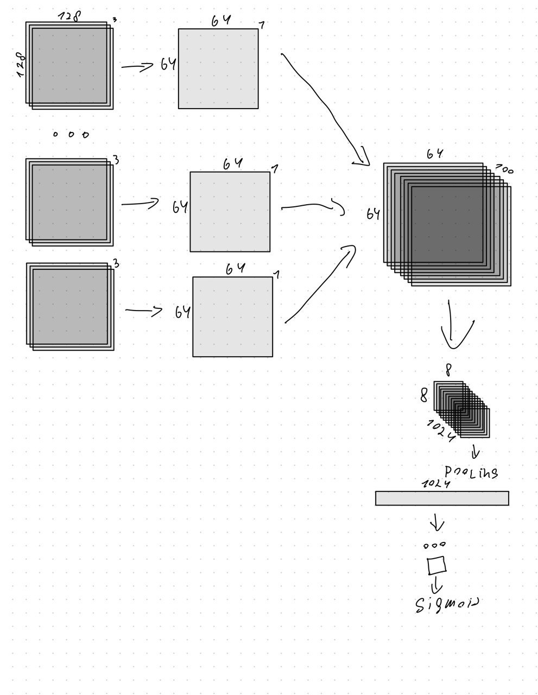

<h1>Обнаружение агресивного поведения</h1>
<h2>Описание задачи</h2>
Наша задача состоит в том, чтобы мы могли получать видеопоток с камеры видеонаблюдения, найти на видео всех людей и классифицировать их поведение как агрессивное или нет.
<h2>Описание текущей модели</h2>
<h3>Вид модели:</h3>

<h2>Порядок работы модели</h2>
&emsp;1. Получение видео. 
&emsp;2. Проходим свертками по каждоу кадру. 
&emsp;3. Получаем одномерную картинку. 
&emsp;4. Накладываем кадры. 
&emsp;5. Затем свертки + fc-слои для классификации поведения 

<h2>Состав команды:</h2>
Артём Летягин - Куратор 

Марк Скворцов - ML Engineer 

Алина Вдовиченко 

Алина Тен 

Василий Постных 

Максим Милешкин 

Алексей Царёв 

